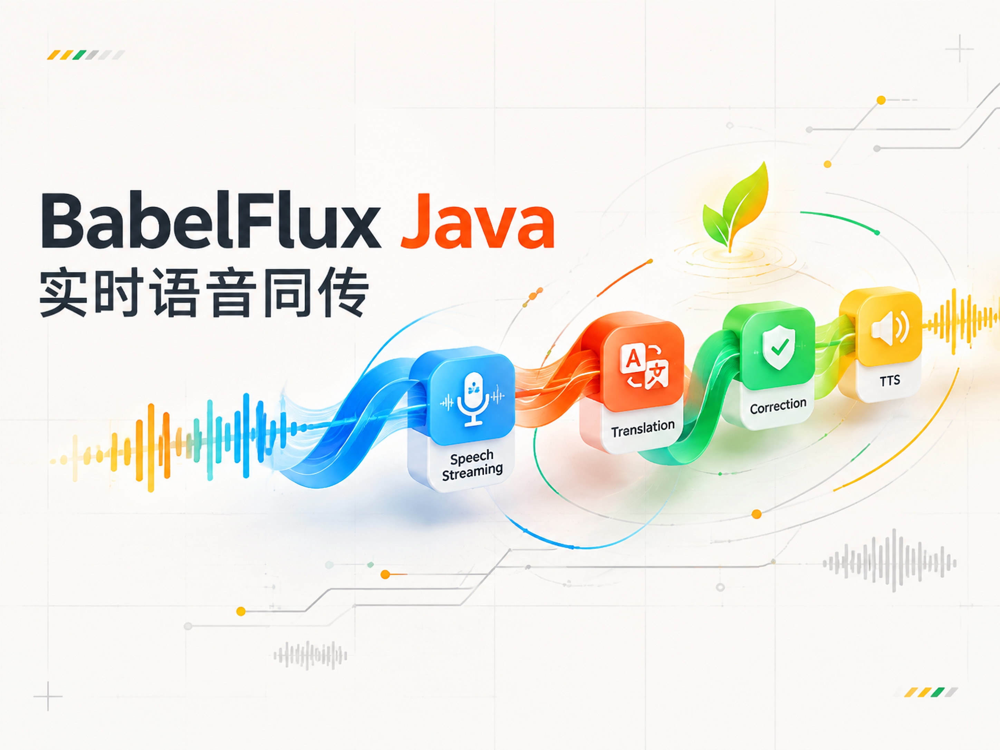
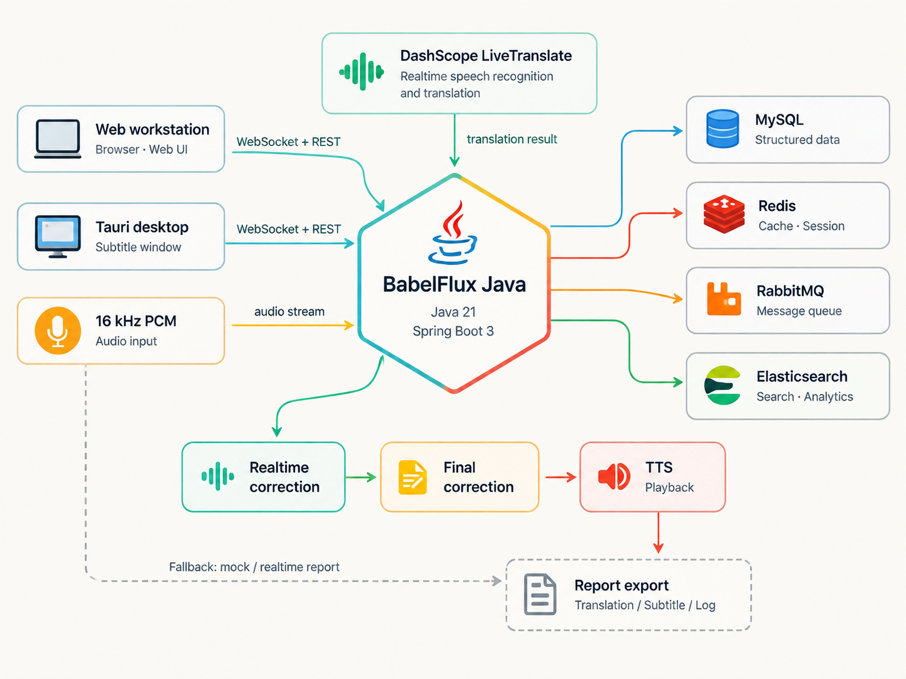

<div align="center">

## DEMO

[](https://www.bilibili.com/video/BV1cjEh6BEyu/)

[点击观看 BabelFlux / 巴别流同传演示视频](https://www.bilibili.com/video/BV1cjEh6BEyu/)

</div>

---


> BabelFlux / 巴别流 同传把英语等外语的**单向音频流**实时翻译成中文，以**双语字幕 / 语音**呈现，并能在传译过程中**自动纠正**已经输出的识别/翻译错误。面向演讲、技术分享、国际会议与网课等「跟不上、听不懂、来不及记」的场景。
>
> 黑客松选题二的完整实现：BabelFlux Web 工作台 + 巴别流 同传桌面悬浮窗 + Spring Boot 后端 + 阿里云百炼真实模型链路。

---

## About

BabelFlux Java 是一个面向演讲、技术分享、国际会议和在线课程的实时语音同传工作台。系统把英语等外语的单向音频流转换为可阅读、可回看、可导出的中文双语字幕，并在说话过程中持续发现术语、数字、否定和跨句语义错误；会话结束后再用完整上下文生成统一术语、修订记录和摘要。

项目的用户体验目标是“听得懂、跟得上、留得住”：用户可以从麦克风、系统音频、浏览器标签页、本地媒体或受限 URL 选择输入，在 Web 工作台实时查看原文/译文和纠偏高亮，也可以把同一会话投送到 Tauri 桌面悬浮窗；结束后在报告历史中查看状态、下载 TXT/SRT/Markdown/JSON，并在模型或网络异常时仍获得可用的实时译文报告。

底层实现采用 Java 21 + Spring Boot 3，WebSocket 承载 16 kHz 单声道 PCM 与字幕事件，REST 管理会话和报告。实时链路连接阿里云百炼 DashScope LiveTranslate，在线纠偏和会后纠偏分层运行；有界 PCM 队列和背压保护长会话，Redis 负责跨实例事件 fan-out，RabbitMQ outbox 解耦异步任务，MySQL 保存会话事实源，Elasticsearch 提供报告索引。模型超时、未配置或中间件不可用时，会按边界降级到 mock 事件流或纯实时译文报告，保证“结束后可查看、可下载”的主流程成立。

实现与验证以仓库内的真实记录为准：前后端均可在 Windows 本机启动，后端测试基线为 122 passed（4 个外部集成默认跳过），前端测试为 56/56，生产构建通过；MySQL、Redis、RabbitMQ、Elasticsearch 和百炼真实链路的启动命令、会话证据、故障边界及用户体验矩阵见 [`docs/verification/voice-experience-matrix.md`](docs/verification/voice-experience-matrix.md)。

---

## 核心特性

| 能力 | 说明 |
| --- | --- |
| 实时识别 + 翻译 | 单条 WebSocket 接入 `qwen3.5-livetranslate-flash-realtime`，服务端 VAD 自动断句，边说边出双语字幕 |
| 实时纠偏（在线） | 传译进行中由 `qwen-flash` 跨句复核，结合后文修正前句的术语/数字/否定/一词多义错误，前端琥珀高亮即时展示 |
| 完整纠偏（会后） | 结束后 `qwen-plus` 通读全场做全局校正、统一术语、生成摘要；六大领域差异化 PROMPT |
| 多源输入 | 在线直链、本地视频/音频（浏览器播放采集）、麦克风、系统音频、屏幕/窗口、浏览器标签页，以及演示模式 |
| 桌面悬浮窗 | Tauri 透明置顶字幕；可自选音源独立采集，或接管 Web 会话；支持拖拽、图钉固定/取消固定、透明度与字号调整 |
| 报告历史 | Web 端与桌面悬浮窗统一沉淀到「报告历史」，集中查看会话、纠偏状态、来源、句数与下载入口 |
| 会话报告导出 | 双语终稿 + 校正记录 + 摘要，支持 TXT / SRT / Markdown / JSON 四种格式；TXT / Markdown 包含会后纠偏摘要与修订记录，SRT 专注字幕结果 |
| 术语表 / 热词 | 术语经引擎 corpus 注入，纠偏与报告全程优先遵循 |
| 可降级 | 模型不可用时优雅降级（mock 事件流 / 纯实时译文报告），保证演示链路始终可跑 |

### 近期功能修正

- Web 工作台新增「报告历史」页面，统一展示 Web 端同传与桌面悬浮窗 standalone 会话；语言、来源、纠偏状态等字段已本地化展示。
- 桌面悬浮窗关闭改为二级确认：点击字幕框关闭按钮后在字幕框内部确认，确认文案直接提示报告可到 Web 首页「报告历史」查看和下载；关闭流程不再自动触发本地下载。
- 桌面悬浮窗默认不固定，图钉按钮支持固定与取消固定；Windows 原生拖拽命中修正后，关闭、图钉、字号、透明度等工具按钮都能稳定点击。
- 同声传译设置页与会话状态已加强重置：返回主屏、刷新页面或重新进入同传时，不再复用上一段上传视频、会话名或播放状态。
- 本地测试视频扩展为中文 / 英文两套素材；上传英文视频时保留用户设置，同时允许自动检测源语言，避免译文单词黏连。
- 媒体播放控制修正：演示视频支持稳定暂停 / 继续，上传视频暂停后可继续播放；播放器默认音量调整为 50%。
- TTS 播报链路优化了媒体元素采集时机、音量和中断处理，减少吃字与下一句提前打断上一句的问题。
- 报告生成接入会后完整纠偏状态、终稿和修订记录；LLM 超时、异常或未配置时自动回退实时译文，仍可生成可下载报告。

---

## 系统架构

三端 + 一条真实模型链路，所有服务可同机部署（演示环境为 Windows 单机）。



### 模型链路与选型

> 均经标准端点 `https://dashscope.aliyuncs.com`（HTTP `/api/v1`、WS `/api-ws/v1`）实测连通。

| 环节 | 模型（`.env` 变量） |
| --- | --- |
| 实时识别 + 翻译 | `qwen3.5-livetranslate-flash-realtime`（`LIVE_TRANSLATE_MODEL`） |
| 内嵌 ASR | `qwen3-asr-flash-realtime`（`LIVE_TRANSLATE_ASR_MODEL`） |
| 实时纠偏（低延迟） | `qwen-flash`（`REALTIME_REVISION_MODEL`） |
| 会后完整纠偏（强模型） | `qwen-plus`（`FINAL_CORRECTION_MODEL`，可换 `qwen3-max` / `deepseek-v4-pro`） |
| 语音合成（可选） | `qwen3-tts-flash-realtime`（`TTS_MODEL`，LiveTranslate voice `Tina`） |

### 后端迁移状态

后端已在独立工作区迁移到 `backend/` 下的 Java 21 + Spring Boot 3.4 模块，原 Python 后端已移除。当前迁移切片提供健康检查、会话生命周期 REST API、兼容的原始 WebSocket 接入、百炼 HTTP/实时 WebSocket 客户端，以及 Redis/RabbitMQ/Elasticsearch 的可选适配器；RabbitMQ 事件 outbox、ES 报告检索与 MySQL 事实源边界已落地。实时链路已接入百炼 LiveTranslate：服务端维护 1 秒有界 PCM 队列、处理 partial/final 双语事件和可选 TTS 音频，在线纠偏在后台复核有界窗口，会后纠偏带超时和降级，并在结束时把段落与报告持久化到 MySQL。中间件默认关闭，启用方式和验证边界见 [backend/README.md](backend/README.md)。

### 界面 03 模型策略

同传设置里的 `03 模型策略` 会随会话 payload 记录为 `modelProfile`，并用于选择实时/会后纠偏模型 profile；实时主链路仍按环境变量固定为 `qwen3.5-livetranslate-flash-realtime` + `qwen3-asr-flash-realtime`。`快速低延迟` 默认使用 `qwen-flash`，`高准确` 默认使用 `qwen-plus`，`成本优先` 默认使用 `qwen-flash`；`gummy` / `fun_asr` 等 provider 回退仍未实现。

### 专业领域

专业领域选项已进入后端会话并影响纠偏 prompt。当前支持 `通用`、`技术`、`商务`、`教育`、`医疗`、`法律`、`自定义术语表`；不同领域会改变实时纠偏和会后纠偏的关注点，例如技术领域优先保留 API、框架、模型、论文名，商务领域更谨慎处理公司、职位、货币和指标，医疗/法律领域会保守处理剂量、症状、条款、责任类表述。领域选项不会替换实时识别翻译模型，主要作用在 `backend/src/main/java/com/babelflux/backend/service/RealtimeRevisionService.java` 和 `FinalCorrectionService.java` 的纠偏提示词与术语处理。

---

## 输入源

Java 后端的 WebSocket 接受 16 kHz 单声道 PCM；当前迁移边界如下：

| 模式 | 入口 |
| --- | --- |
| `url` | Java runner 通过受限 `ffmpeg` 解码 HTTP(S) 直链为 16 kHz 单声道 PCM；支持 host 白名单和保留地址阻断 |
| `upload_video` / `upload_audio` | 前端播放本地媒体元素并采集其音频为 PCM；不上传文件到 Java 后端，避免画面与模型输入双时钟 |
| `microphone` / `system_audio` / `screen_window` / `browser_audio` | 前端 / 桌面用 AudioWorklet 采集为 16k 单声道 PCM，经 WS 二进制帧推送 |
| `media_element_audio` | 本地视频/音频在浏览器播放，前端采集媒体元素音频为 PCM 后推送 |
| `demo` | 无 API key 时使用本地演示事件流 |

> 采集类音源在浏览器/WebView 内用 `AudioContext({sampleRate:16000})` 原生重采样到 16k，分帧约 100ms 推流；前端在 WebSocket 建立后推送，Java runner 以 1 秒有界队列承接并施加背压。

---

## 本地启动

> 依赖：Java 21、Maven、Node 20.19+、Rust stable（桌面端）、WebView2（Windows）。MySQL、Redis、RabbitMQ、Elasticsearch 按需启用。

### 后端

```bash
./scripts/dev-backend.sh    # Spring Boot -> http://localhost:8000
```

接入**真实模型**：设置 `DASHSCOPE_API_KEY`；如使用百炼业务空间，再设置 `DASHSCOPE_WORKSPACE_ID`。其余模型名和纠偏 profile 已在 `backend/src/main/resources/application.yml` 提供默认值。

### 前端

```bash
cp frontend/.env.example frontend/.env
./scripts/dev-frontend.sh   # vite  ->  http://localhost:5173
```

### 桌面悬浮窗

```bash
cd desktop && npm install
npm run tauri dev           # 开发态 devUrl 5175；npm run tauri build 出安装包
npm run client:build        # 生成 release exe（deep link 实测用）
npm run client:register     # 注册 lingosync:// 到 release exe
```

## 桌面投送

Web 工作台右下角的显示器按钮会生成一次性 handoff token（300s TTL），并通过 `lingosync://` deep link 唤起桌面悬浮窗。handoff 模式只接管 Web 会话的字幕事件，本次会话的音源、结束动作和报告下载仍由 Web 端负责；standalone 模式则在桌面端自选系统音频、屏幕/窗口、标签页或麦克风并独立创建会话。

handoff 会话结束后，请回到 Web 工作台等待报告生成，并在报告区或「报告历史」下载 TXT / SRT / Markdown / JSON。桌面 standalone 会话结束时，字幕框会先弹出内嵌确认层；确认后停止采集并等待后端保存报告，不会自动下载文件，也不会弹出浏览器的多文件下载提示。报告统一进入 Web 端首页的「报告历史」查看和下载。

悬浮窗默认不固定，可拖拽到任意位置；图钉只控制是否固定位置，点击后仍可再次取消固定。关闭、图钉、字号、透明度等工具按钮位于字幕框工具栏，Windows 原生窗口区域不会拦截这些点击。

切换网页上下文时不会复用旧上下文：handoff token 绑定到当前 Web session，桌面端兑换后订阅同一 session 的 WebSocket。用户从中文视频页切到英文视频页、或切换音源来源时，应结束当前会话并重新投送；否则桌面悬浮窗仍显示旧 session 的字幕事件。

默认服务地址：

```text
REST       http://localhost:8000/api
WebSocket  ws://localhost:8000/api/ws/sessions/{session_id}
Health     http://localhost:8000/api/health
```

---

## WebSocket 事件协议

路由 `/api/ws/sessions/{sessionId}`，字段统一 camelCase。

- 客户端到服务端：`start_session`（可携带语种/领域/源覆盖项）、二进制 PCM 帧、`audio_end` / `audio_chunk_end`、`stop_session`、`pause_session` / `resume_session`
- 服务端到客户端：`session_started`、`source_sync_state`、`transcript_segment`、`translation_segment`、`revision_event`、`session_report{reportId}`、`error`

DashScope 网关也以 REST 暴露，便于单独调试：

```text
POST /api/models/llm/generate
POST /api/models/asr/transcriptions
POST /api/models/tts/speech
```

---

## 报告历史与导出

所有后端会话都会写入历史索引，Web 首页的「报告历史」是统一入口。列表展示会话名称、来源、语言方向、句数、生成时间和纠偏状态；来源如系统音频、浏览器音频、上传视频等会以中文展示，便于区分 Web 端同传和客户端悬浮框会话。

导出格式说明：

| 格式 | 内容定位 |
| --- | --- |
| TXT | 最完整的纯文本报告：会话概览、摘要、双语终稿、实时修正、会后完整纠偏与质量说明 |
| Markdown | 面向阅读和归档的结构化报告，包含摘要、指标、纠偏状态和修订记录 |
| SRT | 面向播放器字幕导入，只保留时间轴和最终字幕文本，不包含纠偏报告段落 |
| JSON | 完整结构化数据，包含 segments、revisions、metrics、correctionStatus 等字段，便于二次处理 |

会后完整纠偏可能晚于基础报告完成。系统会先保存可下载的基础报告，再异步更新纠偏状态与最终修订；历史页刷新后可看到最新状态。

---

## 目录结构

```text
.
├── backend/                 Java 21 + Spring Boot 3.4 后端服务
│   ├── src/main/.../web     REST / WebSocket 适配器
│   ├── src/main/.../service 会话、媒体、纠偏与报告编排
│   ├── src/main/.../provider DashScope HTTP / WebSocket 适配器
│   └── src/test/            单元、契约与边界测试
├── frontend/                Vue 3 + Vite + Pinia Web 工作台
│   ├── public/fixtures/     默认测试视频与字幕素材
│   └── src/                 组件、状态、输入源、字幕视图与报告下载
├── desktop/                 Tauri v2 桌面悬浮字幕客户端
├── docs/                    架构、设计、后端联调与项目计划文档
├── scripts/                 本地启动与检查脚本
├── tools/                   可选本地工具目录（如 ffmpeg）
├── .env.example             后端环境变量模板
└── providers.example.yaml   模型供应商配置示例
```

---

## 技术栈

| 层级 | 技术 | 为什么选择 |
| --- | --- | --- |
| Web 工作台 | Vue 3、Vite、TypeScript、Pinia | 实时同传界面状态多、更新频繁，Vue 组合式 API + Pinia 适合把会话、字幕、报告、输入源拆成清晰状态；Vite 保证开发调试快，TypeScript 降低 WebSocket 事件和报告结构的维护成本。 |
| 字幕交互 | GSAP、CSS、@vueuse/core、@floating-ui/vue、video.js | 字幕流需要平滑入场、纠偏高亮、悬浮定位和媒体预览控制；这些库覆盖动画、浏览器能力封装、浮层定位与播放器能力，不需要为常见交互重新造轮子。 |
| 后端服务 | Java 21、Spring Boot 3.4、Maven、虚拟线程、JDBC | 长连接事件流由 WebSocket runner 编排；领域服务、provider adapter 和持久化端口分层，便于测试和替换。会后纠偏在事务挂起边界内执行，超时自动降级。 |
| 数据与中间件 | MySQL、Redis、RabbitMQ、Elasticsearch | MySQL 保存会话事实与 outbox，Redis 保存带 TTL 的票据，RabbitMQ 负责可重试事件，ES 作为可重建报告索引；默认关闭以保持本地可运行。 |
| 桌面悬浮窗 | Tauri v2、Vue 3、deep-link、global-shortcut、store 插件 | 桌面端需要轻量、透明置顶、快捷键和 Web 会话接管；Tauri 复用前端技术栈，同时比传统 Electron 包体更小，适合演示和后续分发。 |
| 模型链路 | 阿里云百炼 DashScope、LiveTranslate、qwen-flash、qwen-plus、qwen-tts | LiveTranslate 提供实时 ASR + 翻译低延迟链路；qwen-flash 用于在线跨句纠偏，qwen-plus 负责会后全局校正，按任务强度拆模型可以兼顾速度、成本和最终质量。 |

这套技术栈的核心取舍是：前端优先保证字幕阅读体验和媒体控制一致性，后端优先保证异步流式链路稳定，模型层则把“实时可用”和“会后更准”拆成两级能力，避免用单一模型承担所有延迟与质量目标。

---

## 测试与验证

```bash
cd backend && mvn -B test              # Java 后端单元/契约测试（122 passed，4 个外部集成测试按默认配置跳过）
cd frontend && npm run test -- --run   # 前端 Vitest（56 passed）
cd frontend && npm run build           # 前端 vue-tsc + Vite 生产构建
cd desktop && npx vue-tsc --noEmit     # 桌面类型检查
cd desktop && npm run client:build     # 桌面 release exe，验证 deep link 实际运行包
```

测试数量以最近一次完整运行结果为准；外部 MySQL、Redis、RabbitMQ、Elasticsearch 和百炼实验不作为每次本地单元测试的默认依赖，必须在验证记录中单独列出版本、地址、输入和边界。

前端重点回归：

- `frontend/src/components/workbench/FloatingCaption.test.ts` —— 验证悬浮字幕关闭按钮、内嵌确认层、取消/确认事件和 Tauri 拖拽区隔离。
- `frontend/src/App.test.ts` —— 覆盖会话初始化、报告历史、播放控制、TTS、上传媒体与 fixture 同传状态。

Java 迁移当前已验证健康检查、会话/报告 REST、WebSocket PCM 控制、URL 媒体 ffmpeg 解码、MySQL/Redis/RabbitMQ/ES 适配器契约和纠偏降级路径；本地上传文件仍由前端媒体元素采集后推送 PCM。历史 Python 联调记录见 [`docs/backend/实现总览与联调备份_AI同声传译.md`](docs/backend/实现总览与联调备份_AI同声传译.md)。

---

## 开发规范

- 主分支 `main` 始终保持可运行 / 可审阅；新功能走独立分支 + PR，单个 PR 只做一件事。
- 分支命名、commit、Issue 和 PR 的完整格式、语言和安全要求统一以 [`CONTRIBUTING.md`](CONTRIBUTING.md) 为准，不在此维护第二套规则。
- PR 必须关联 Issue，并按模板记录用户可观察变化、实现边界、实验结果、实际验证命令、风险与回滚方式；每次有意义的实测及时用“实验 / 结果 / 结论”回贴，失败实验也保留。
- 标题默认使用 `gitemoji type(scope): 中文摘要`（如 `🐛 fix(websocket): 限制跨实例实时 runner`），描述和评论默认使用中文；命令、代码标识和协议名可保留英文但需有中文说明。

---

## 当前状态

BabelFlux / 巴别流 同传的 Java 迁移切片已落地为可运行的会话、实时 PCM、URL 媒体输入、双层纠偏、报告导出和可选中间件链路；桌面端 deep-link 当前兼容保留 `lingosync://` 协议，便于已注册客户端平滑升级。当前 `main` 只保留主分支，最近合并的实现和验证记录如下：

| 记录 | 已确认结果 |
| --- | --- |
| [PR #95](https://github.com/ZhaoXingPeng/BabelFLUX-java/pull/95) 会后纠偏缺段补救 | 缺失分段只在原始 deadline 内定向补救；超时/非法 JSON 保留实时译文；定向测试 10/10，真实百炼 5 句会话和 MySQL/Redis/RabbitMQ/Elasticsearch 闭环已记录 |
| [PR #94](https://github.com/ZhaoXingPeng/BabelFLUX-java/pull/94) ES 索引设置幂等 | 避免每份报告重复更新副本设置，并保留 provider 根因 |
| [PR #91](https://github.com/ZhaoXingPeng/BabelFLUX-java/pull/91) TTS 播放代际 | 新句到达时停止旧音频，迟到旧块不再回放；5 次真实会话已验证序列和错误数 |
| [PR #87](https://github.com/ZhaoXingPeng/BabelFLUX-java/pull/87) JDBC 调度时间精度 | 统一整秒 timestamp 的 claim/lease/backoff 取整规则，真实 MySQL/ES 索引闭环通过 |
| [PR #98](https://github.com/ZhaoXingPeng/BabelFLUX-java/pull/98) 首页规范标题 | 根目录文档、模板和示例配置已统一为中文 Gitmoji 提交语义，旧历史未重写 |

已完成能力不等同于生产级结论：20 分钟长时稳定性、>=5 次同规模性能分位数、浏览器 `bufferedAmount` 背压、扬声器声学测量、多节点中间件 HA 和百炼模型覆盖仍在 [Issue #96](https://github.com/ZhaoXingPeng/BabelFLUX-java/issues/96) 排队，必须用真实启动、真实输入和可审计日志逐项验证。

## 工程规范入口

- 规范总索引、证据等级和最近工作确认：[`docs/standards/README.md`](docs/standards/README.md)
- 贡献、Issue、gitemoji commit 与 PR 实验记录：[`CONTRIBUTING.md`](CONTRIBUTING.md)
- 分层、依赖方向、事件契约与长文件拆分规则：[`docs/standards/architecture.md`](docs/standards/architecture.md)
- Java 后端编码、并发和测试约束：[`docs/standards/java-backend.md`](docs/standards/java-backend.md)
- STAR 实验回帖模板：[`docs/process/star-performance-template.md`](docs/process/star-performance-template.md)
- 安全与密钥处理：[`SECURITY.md`](SECURITY.md)
- 自动质量门禁：[`Quality Gates`](.github/workflows/ci.yml)
